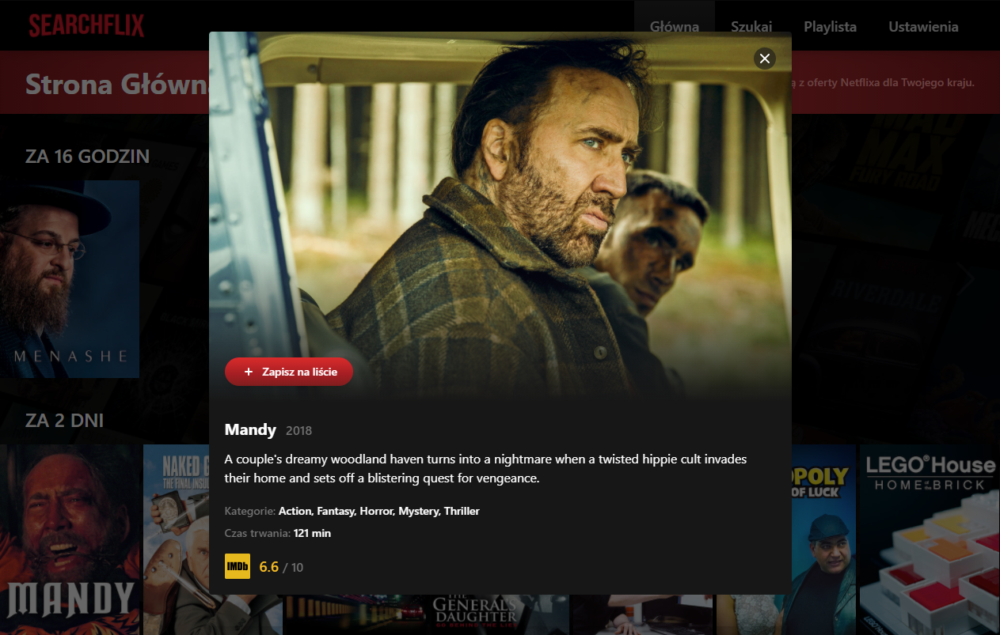

> This is a search engine for Netflix, written in Nuxt.js as a PWA, using the unogsNG API. 
> Live demo [_here_](https://searchflix.netlify.app/).

## Table of Contents
* [General Info](#general-information)
* [API](#api)
* [Technologies Used](#technologies)
* [Features](#features)
* [Screenshot](#screenshot)
* [Environment variables](#environment-variables)
* [Setup](#setup)
* [Project Status](#project-status)

## General information
Non-commercial app made for personal use. The possible coincidence of names with other applications is not intentional.

## API
The project uses the [**unogsNG API**](https://rapidapi.com/unogs/api/unogsng/) from RapidAPI.

## Technologies
- Nuxt.js
- Tailwind

## Features
- list of expiring titles (based on user's localization)
- extensive movie search
- saving movies to the user's list (localStorage)
- due to the number of requests, static endpoints have been replaced with JSON files with data
- the application can be installed on Android as a PWA

## Screenshot


## Environment variables
The variable names can be found in the _.env.example_ file. You will need an API key to run the project.

## Setup
```
npm install
npm run dev
```

## Project status
Project is _in progress_. Tested for bugs & opportunities for improvement.